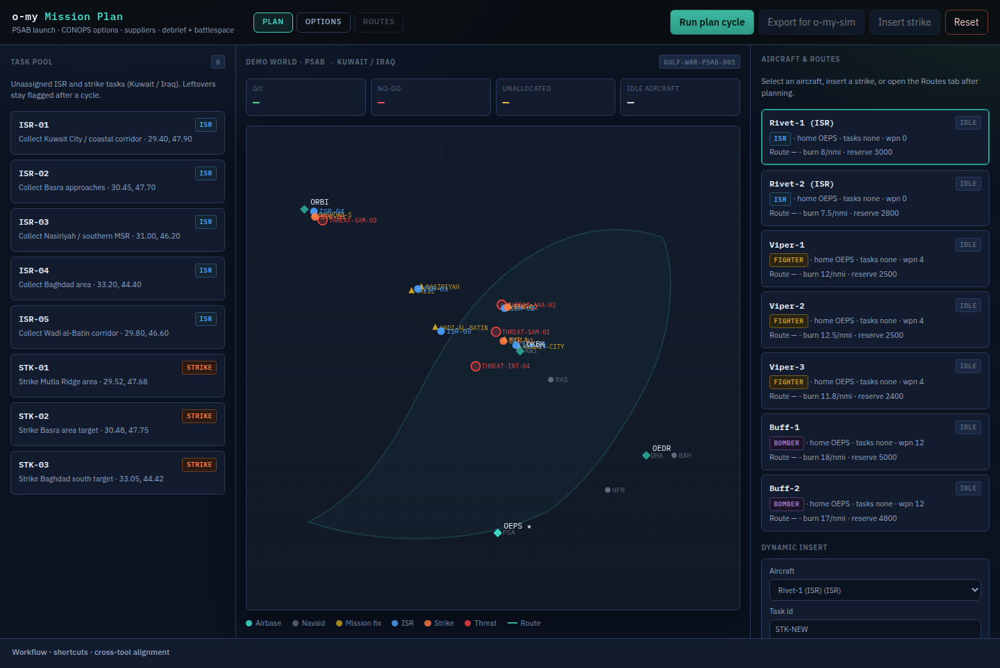
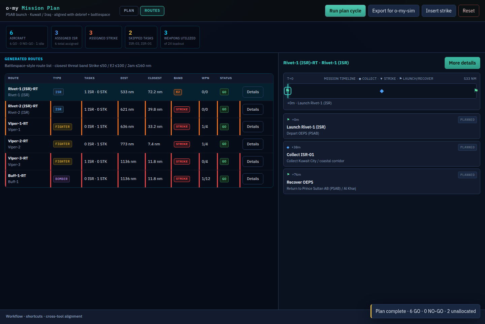
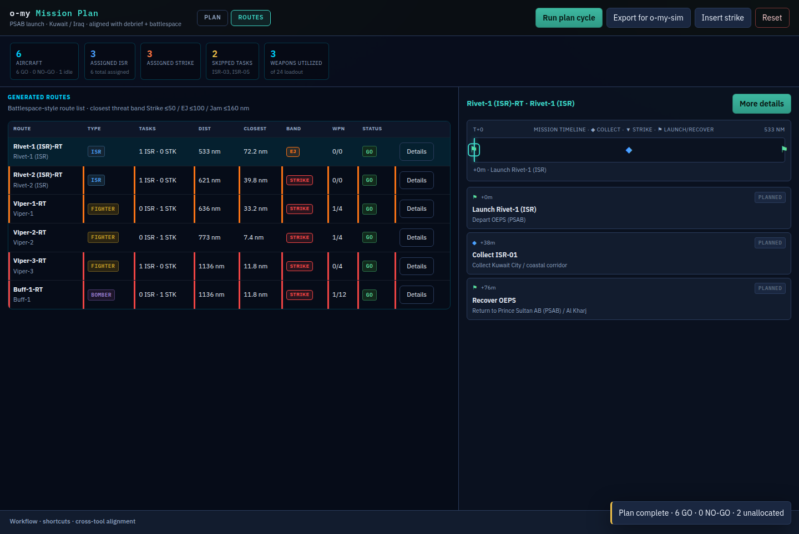
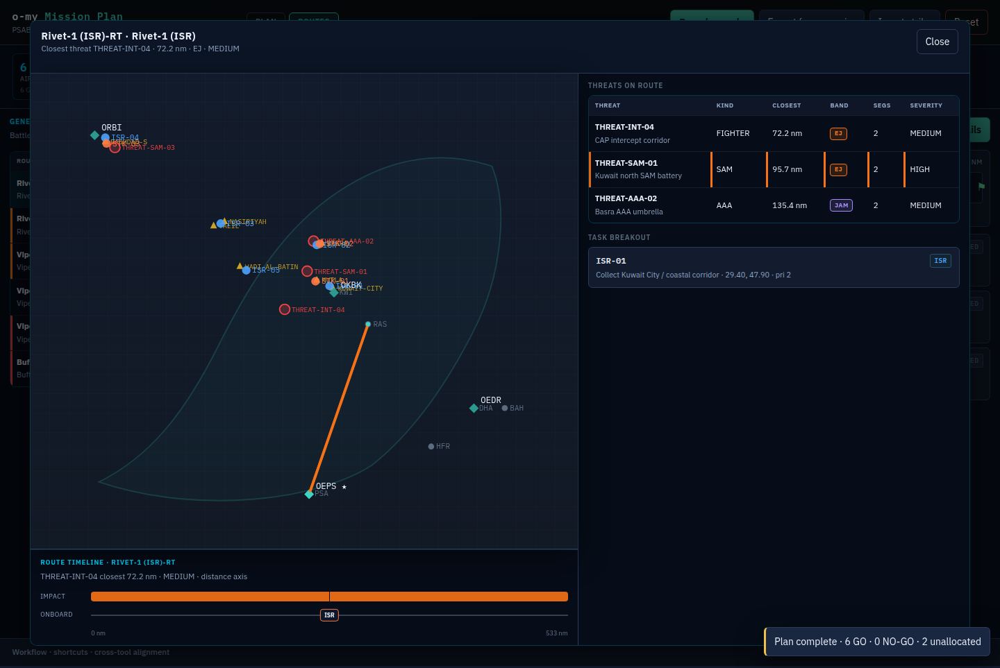

# o-my Mission Plan

**Mission planning capability for the Open Arsenal / o-my OMS ecosystem.**

Functional prototype for iterative “guess-and-see” mission planning cycles in a
**Gulf War / PSAB launch** scenario:

- Simulate ATO ingestion → pool of unassigned collection (ISR) and strike tasks across **Kuwait and Iraq**
- Aircraft all launch from **Prince Sultan AB (PSAB / OEPS)**
- Simple task allocation: group tasks by region and assign to suitable aircraft (ISR / fighter / bomber)
- Initial route generator that sequences **published waypoints** (airbases + commercial navaids + fixed mission fixes)
  - proximity success criteria: within **80 nmi** of ISR / collection tasks
  - within **20 nmi** of strike tasks
  - never invents runtime `PROX-*` lat/lon points (see [`docs/ROUTE-GENERATION.md`](docs/ROUTE-GENERATION.md))
- FastAPI **Route Propagation Service** that tracks fuel remaining and burn rate per leg
- **Export final GO routes** as JSON for **o-my-sim** to import and publish on `uci.route` when aircraft launch (see [`docs/OMY-SIM-ROUTES.md`](docs/OMY-SIM-ROUTES.md))
- Dark-theme planning console guided by **IxDF / Nielsen usability heuristics**

---

## Status

**Functional prototype implemented** (scenario: `gulf-war-psab-001`).

| Capability | Status |
|------------|--------|
| OpenSpec + Gherkin acceptance scenarios | Done |
| Beads epic + phased issues | Done |
| Gulf War / PSAB demo world (Kuwait & Iraq tasks) | Done |
| Mock ATO → unassigned task pool | Done |
| Simple regional task allocator | Done |
| Initial route generator (published waypoints + proximity check) | Done |
| Route Propagation Service (FastAPI + fuel/burn) | Done |
| Dynamic task insertion + re-propagation | Done |
| Final route export for o-my-sim (`uci.route` on launch) | Done |
| Dark-theme IxDF planning UI | Done |
| Routes overview (battlespace table + debrief timeline) | Done |
| Route details drawer (map + threats + tasks) | Done |
| Pluggable route suppliers (`ROUTE_SUPPLIER`) | Done (fallback + ORF/costgrid adapters) |
| CONOPS Mission Options A/B/C + compare / re-run | Done |
| Unit / API tests | Done (`make test`) |

---

## Quick start

```bash
python3 -m pip install -e ".[test]"
make demo
# open http://localhost:8000
# API docs: http://localhost:8000/docs
```

1. **Run plan cycle** (or press `P`)
2. **Export for o-my-sim** (or press `E`) → writes `data/routes/gulf-war-psab-001-routes-latest.json`
3. Point o-my-sim at that file; it publishes each GO route on launch

Keyboard shortcuts: **P** plan · **E** export · **I** insert · **R** reset · **1**/**2** Plan/Routes · **?** help.

---

## What's implemented

### Backend (`src/omy_mission_plan/`)

| Module | Role |
|--------|------|
| `models.py` | Aircraft, Task, Route, FuelState, AllocationResult, … |
| `demo_world.py` | PSAB launch, Kuwait/Iraq tasks, navaids + mission waypoints |
| `allocator.py` | Regional grouping + type-capable assignment; always returns unallocated ids |
| `route_generator.py` | Fallback published-fix path + task association (no PROX-*) |
| `suppliers/` | Pluggable adapters: fallback, openRouteFinder, cost-grid stub |
| `propagator.py` | Constant burn + fixed reserve → GO / NO-GO |
| `planning.py` | Full plan cycle + dynamic insert via selected supplier |
| `options.py` | Mission Options store (A/B/C, compare, re-run) |
| `export_routes.py` | o-my-sim import bundle (`o-my.mission-plan.routes/v1`) |
| `routes_overview.py` | Metrics, threat bands, debrief-style timelines |
| `app.py` | FastAPI service + static UI |

### API

| Method | Path | Description |
|--------|------|-------------|
| GET | `/api/health` | Liveness |
| GET | `/api/world` | Demo fixtures snapshot (scenario + mission waypoints) |
| POST | `/api/reset` | Reset in-memory world |
| POST | `/api/plan` | Allocate → supplier route → fuel propagate |
| GET | `/api/plan` | Latest plan result |
| GET | `/api/suppliers` | Active + available route suppliers |
| POST | `/api/tasks/insert` | Inject task; full re-assess for one aircraft |
| POST | `/api/propagate` | Fuel-propagate an arbitrary route |
| POST | `/api/options` | Create Mission Option (emphasis + router inputs) |
| POST | `/api/options/top-three` | Fill slots A/B/C (Efficient / Synchronized / Unexpected-axis) |
| GET | `/api/options` | List options + slot map |
| GET | `/api/options/compare` | Side-by-side comparison metrics |
| POST | `/api/options/{id}/slot` | Pin option to A/B/C |
| POST | `/api/options/{id}/rerun` | Re-run with saved/patched inputs |
| POST | `/api/options/{id}/prefer` | Mark preferred option for export |
| POST | `/api/routes/export` | Write final GO routes (optional `option_id`) |
| GET | `/api/routes/export` | Build export bundle without writing |
| GET | `/api/routes/overview` | Routes screen: metrics, threats, timelines |
| GET | `/` | Dark planning UI |
| GET | `/docs` | Swagger |

Set `ROUTE_SUPPLIER=fallback|openroutefinder|costgrid` to select the lateral path adapter (default `fallback`).

### Docs

- [`docs/CONOPS.md`](docs/CONOPS.md) — iterative cycle + top-three Mission Options
- [`docs/SUPPLIER-ROUTE-TOOLS.md`](docs/SUPPLIER-ROUTE-TOOLS.md) — supplier tool survey + adapter model
- [`docs/INTEGRATION-GUIDE.md`](docs/INTEGRATION-GUIDE.md) — wiring suppliers and options
- [`docs/CIVIL-ROUTE-DEV-GUIDE.md`](docs/CIVIL-ROUTE-DEV-GUIDE.md) — civil / Dijkstra path
- [`docs/MISSION-ROUTE-DEV-GUIDE.md`](docs/MISSION-ROUTE-DEV-GUIDE.md) — mission constraints for B/C
- [`docs/DEMO-WORLD.md`](docs/DEMO-WORLD.md) — PSAB / Kuwait / Iraq scenario
- [`docs/ROUTE-GENERATION.md`](docs/ROUTE-GENERATION.md) — published-waypoint-only design
- [`docs/OMY-SIM-ROUTES.md`](docs/OMY-SIM-ROUTES.md) — export contract for o-my-sim
- [`docs/examples/gulf-war-psab-001-routes-example.json`](docs/examples/gulf-war-psab-001-routes-example.json) — sample bundle

### UI (IxDF principles)

Dark ops console aligned with **o-my-debrief** (timeline / key events) and
**battlespace-manager** (route table, threat bands, map + segment timeline).
Plan tab for guess-and-see cycles; Routes tab for fleet overview metrics and
per-route inspection; More details for map / threats / task breakout.

---

## Screenshots

### 1. Plan tab — PSAB / Kuwait / Iraq



### 2. Routes overview — metrics + battlespace-style route list

Top-line metrics: aircraft count, assigned ISR/strike breakout, skipped tasks, weapons utilized.



### 3. Route timeline / key events (o-my-debrief alignment)



### 4. More details — map, threats, task breakout (battlespace-manager layout)




---

## Design Principles

1. **Keep the core small.** The Route Propagation Service is the single source of truth for live routes + fuel state.
2. **Iterative by nature.** Mission planning is a series of “guess what is possible” cycles.
3. **UCI-first contracts.** Final routes are exported so o-my-sim can publish `uci.route` on launch.
4. **Demo realism without complexity.** PSAB launch + published Gulf theater fixes; burn models stay deliberately simple.

---

## Tests

```bash
make test
```

---

## Related repos

- [`o-my`](https://github.com/mowgli42/o-my) — C2 / UCI bus processors
- [`o-my-debrief`](https://github.com/mowgli42/o-my-debrief) — Platform debrief
- [`o-my-sim`](https://github.com/mowgli42/o-my-sim) — publishers / scenario clock (imports routes from this service)
- [`fuzzy-reconciler`](https://github.com/mowgli42/fuzzy-reconciler) — reference OpenSpec + FastAPI layout

## License

See [LICENSE](LICENSE).
