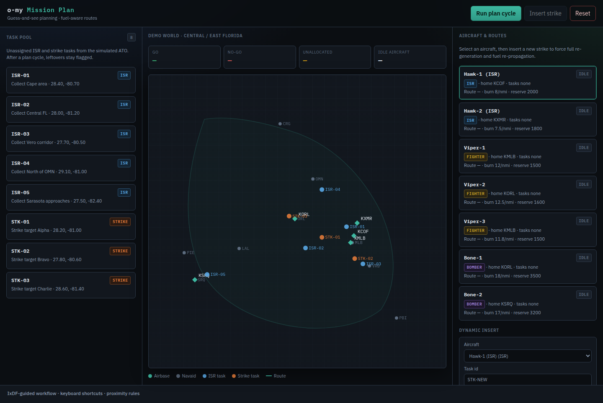
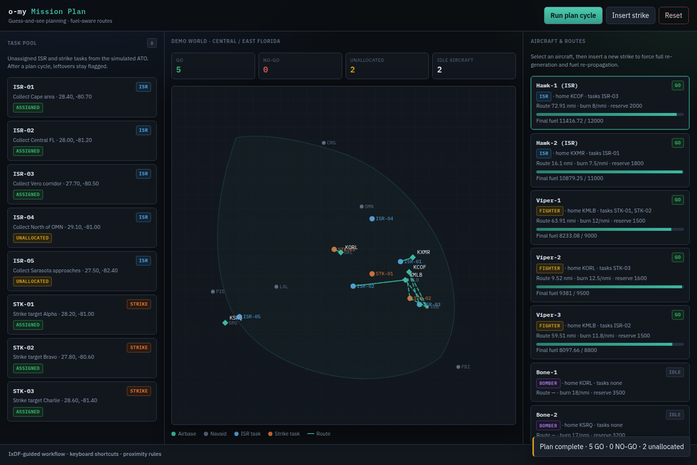
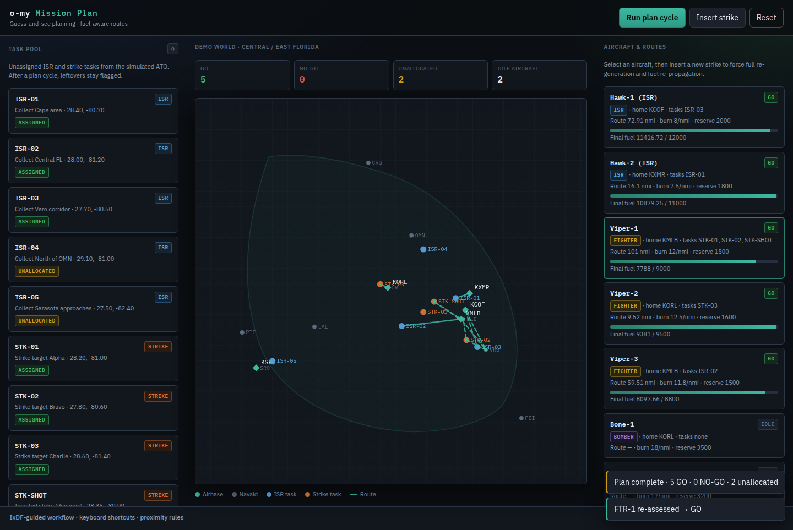
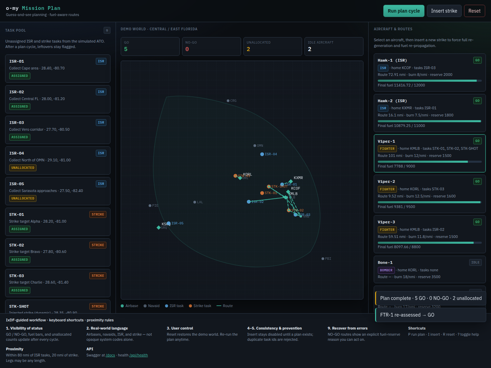

# o-my Mission Plan

**Mission planning capability for the Open Arsenal / o-my OMS ecosystem.**

Functional prototype for iterative “guess-and-see” mission planning cycles:

- Simulate ATO ingestion → pool of unassigned collection (ISR) and strike tasks
- Simple task allocation: group tasks by region and assign to suitable aircraft (ISR / fighter / bomber) that have a home airbase
- Initial route generator that sequences **published waypoints** (airbases + commercial navaids)
  - proximity success criteria: within **80 nmi** of ISR / collection tasks
  - within **20 nmi** of strike tasks
  - never invents runtime `PROX-*` lat/lon points (see [`docs/ROUTE-GENERATION.md`](docs/ROUTE-GENERATION.md))
- FastAPI **Route Propagation Service** that tracks fuel remaining and burn rate per leg so the platform can safely complete the route
- Dark-theme planning console guided by **IxDF / Nielsen usability heuristics**
- Designed so external suppliers can later implement richer services and talk to this core via **UCI messages**

---

## Status

**Functional prototype implemented.** OpenSpec + Gherkin describe the capability; Beads tracks remaining polish.

| Capability | Status |
|------------|--------|
| OpenSpec + Gherkin acceptance scenarios | Done |
| Beads epic + phased issues | Done |
| Mock ATO → unassigned task pool | Done |
| Simple regional task allocator | Done |
| Initial route generator (published waypoints + proximity check) | Done |
| Route Propagation Service (FastAPI + fuel/burn) | Done |
| Dynamic task insertion + re-propagation | Done |
| Demo world (Central/East Florida navaids + airbases) | Done |
| Dark-theme IxDF planning UI | Done |
| Unit / API tests | Done (`make test`) |

---

## Quick start

```bash
python3 -m pip install -e ".[test]"
make demo
# open http://localhost:8000
# API docs: http://localhost:8000/docs
```

Keyboard shortcuts in the UI: **P** run plan · **I** insert strike · **R** reset · **?** toggle help.

---

## What's implemented

### Backend (`src/omy_mission_plan/`)

| Module | Role |
|--------|------|
| `models.py` | Aircraft, Task, Route, FuelState, AllocationResult, … |
| `demo_world.py` | 2 ISR + 3 fighters + 2 bombers, 5 ISR + 3 strike tasks, Florida airbases/navaids |
| `allocator.py` | Regional grouping + type-capable assignment; always returns unallocated ids |
| `route_generator.py` | Home → published fixes → home (proximity validated; no PROX-*) |
| `propagator.py` | Constant burn + fixed reserve → GO / NO-GO |
| `planning.py` | Full plan cycle + dynamic insert (full re-generate + re-propagate) |
| `app.py` | FastAPI service + static UI |

### API

| Method | Path | Description |
|--------|------|-------------|
| GET | `/api/health` | Liveness |
| GET | `/api/world` | Demo fixtures snapshot |
| POST | `/api/reset` | Reset in-memory world |
| POST | `/api/plan` | Allocate → route → fuel propagate |
| GET | `/api/plan` | Latest plan result |
| POST | `/api/tasks/insert` | Inject task; full re-assess for one aircraft |
| POST | `/api/propagate` | Fuel-propagate an arbitrary route |
| GET | `/` | Dark planning UI |
| GET | `/docs` | Swagger |

### UI (IxDF principles)

Dark ops console emphasizing:

1. **Visibility of system status** — GO / NO-GO counts, fuel bars, toasts  
2. **Match the real world** — airbases, navaids, ISR / strike language  
3. **User control & freedom** — Reset, re-run plan anytime  
4. **Consistency & standards** — shared badges / status colors  
5. **Error prevention** — insert disabled until a plan exists; duplicate task ids rejected  
6. **Recognition over recall** — full task pool + fleet always visible  
9. **Error recovery** — explicit fuel-reserve NO-GO reasons  
10. **Help & documentation** — expandable IxDF workflow + shortcuts + `/docs`

---

## Screenshots

### 1. Initial dark UI (task pool + Florida demo world)



### 2. After plan cycle — assignments, routes, GO / unallocated feedback



### 3. Dynamic strike insert — full re-assess for selected aircraft



### 4. IxDF help panel (heuristics, shortcuts, proximity rules)



---

## Design Principles

1. **Keep the core small.** The Route Propagation Service is the single source of truth for live routes + fuel state.
2. **Iterative by nature.** Mission planning is a series of “guess what is possible” cycles. The prototype makes those cycles fast and visible.
3. **UCI-first contracts.** Everything that will eventually be an external supplier service publishes/consumes UCI-aligned messages.
4. **Demo realism without complexity.** Real commercial navaids and realistic Florida airbases; distances and burn models stay deliberately simple.

---

## Tests

```bash
make test
```

Covers allocator feedback, route proximity rules, fuel GO/NO-GO, and API plan/insert flows.

---

## Related repos

- [`o-my`](https://github.com/mowgli42/o-my) — C2 / UCI bus processors
- [`o-my-debrief`](https://github.com/mowgli42/o-my-debrief) — Platform debrief (same OpenSpec + Beads + FastAPI pattern)
- [`o-my-sim`](https://github.com/mowgli42/o-my-sim) — publishers / scenario clock (when available)
- [`fuzzy-reconciler`](https://github.com/mowgli42/fuzzy-reconciler) — reference OpenSpec + Svelte/FastAPI layout

## License

See [LICENSE](LICENSE).
