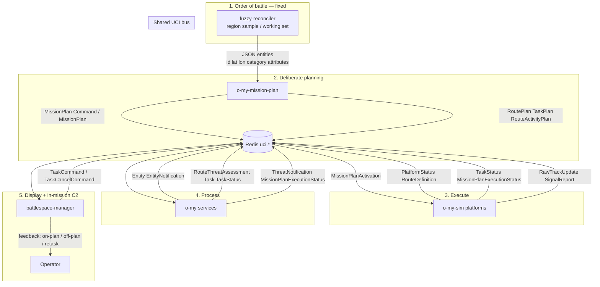
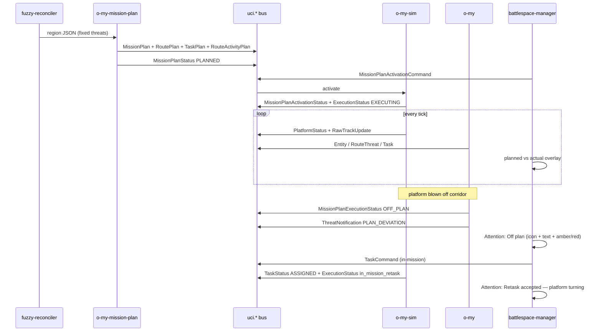

# Architecture — o-my mission data flow

How **fuzzy-reconciler** region samples become a **UCI MissionPlan**, how **o-my-sim** flies and tasks it, how **o-my** processes the bus, and how **battlespace-manager** shows planned vs actual with operator feedback.

This repo already ships the PSAB / published-waypoint planner (allocate → route → fuel GO/NO-GO → export `uci.route`). This document is the **stack wiring**: catalog messages, fixed-threat ingest, execution feedback. Message names are **Open Arsenal UCI 2.5**. Transport today is Redis `uci.*` (OMS ASB stand-in), Tier B UCI-Lite XML.

---

## Who / why / what / how

| | |
|--|--|
| **Who** | CAOC / mission-planning operator watching a COP, plus the services that generate and execute the plan. |
| **Why** | Plans are currently baked into `o-my-sim` Gulf War JSON. Fixed IADS sites already exist as fuzzy-reconciler region samples, but nothing turns that working set into an executable MissionPlan or tells the operator when the package leaves the plan. |
| **What** | Ingest fuzzy-reconciler **fixed** threats (SAM, radar, BM, C2, coastal, ELINT) into the existing allocator, emit `MissionPlan` + `RoutePlan` + `TaskPlan` + `RouteActivityPlan`, fly in sim, process in o-my, display planned vs flown with in-mission retask feedback. |
| **How** | UCI 2.5 plan lifecycle on the shared bus. IxDF: always show system status; feedback is a message, not a UI-only toast. |

---

## Repo roles (normative)

```text
fuzzy-reconciler     SOURCE of fixed-threat lists (region samples / published working set)
o-my-mission-plan    PLANNER — MissionPlan + sub-plans (this repo)
o-my-sim             PUBLISHER — flies RoutePlan, executes TaskPlan, emits kinematics + task status
o-my                 PROCESSOR — fusion, route-threat, allocation, deviation, F2T2EA
battlespace-manager  SUBSCRIBER — COP; never the system of record
o-my-debrief         RECORDER — optional after-action tap of the same bus
```

Nothing operational bypasses `uci.*`. Displays do not invent tracks or tasks.

---

## End-to-end workflow



### Phase 1 — Fixed threats

fuzzy-reconciler `fixtures/regions/{gulf,iran,…}_base.json` (and the published working set) already use a stable entity schema:

`id`, `name`, `lat`, `lon`, `analyzed_at`, `category`, `attributes` (`range_km`, `band`, `status`, `anchor`, …)

**Fixed** categories consumed by the planner (airports are ignored — they are not IADS threats):

`sam_site` · `surveillance_radar` · `early_warning_radar` · `ballistic_missile_site` · `coastal_defense` · `command_post` · `elint_site`

Movement is `fixed`. Mobile TELs / fighters still come from o-my-sim scenario overlays if needed; this planner’s contract is **fixed sites**.

### Phase 2 — Generate MissionPlan

UCI 2.5: a `MissionPlan` is an **aggregation of sub-plans**. Sub-plans can only be **activated and executed as part of a MissionPlan**.

| Sub-plan | Role in this stack |
|----------|--------------------|
| `RoutePlan` | Kinematic WGS-84 waypoints per platform (ingress / orbit / CAP / tgt / egress) |
| `TaskPlan` | Ordered tasks (SEAD → ISR → STRIKE) with predecessors |
| `RouteActivityPlan` | When along the route a task executes |

Planner output is also an o-my-sim **scenario overlay** (`coalitionPlatforms[].route.waypoints`, `highValueTargets` with `movement.pattern = fixed`).

### Phase 3 — Activate and fly

1. Operator (or compose) publishes `MissionPlanActivation` / `MissionPlanActivationCommand`.
2. o-my-sim scenario-director seeks T+0, loads generated scenario.
3. Each platform interpolates its `RoutePlan` (`platform_routes.py` already supports `pattern: transit` waypoints).
4. platform-status-sim publishes `PlatformStatus` (position, `route_name`, `active_task_id`) and optional `RouteDefinition` geometry (`uci.platform.route`).
5. At `RouteActivityPlan` offsets, sim emits `TaskStatus` `IN_PROGRESS` / `COMPLETE` and continues the route.

### Phase 4 — o-my processes realtime sim data

Existing o-my processors (do not duplicate in sim):

| Service | In | Out |
|---------|----|-----|
| entity-fusion | `RawTrackUpdate`, `SignalReport` | `CorrelatedEntity` |
| entity-sorter | correlated | `Entity` / `EntityNotification` |
| oms-state-tracker | platform status + route | `OmsStateSnapshot` |
| route-threat-monitor | route model + entities | `RouteThreatAssessment` |
| route-task-allocator / ISR / strike | OMS state + threats | `Task` / `TaskStatus` |
| threat-notifier | assessments | `ThreatNotification` → Attention Rail |
| **plan-monitor** *(new, o-my)* | `RoutePlan` + `PlatformStatus` | `MissionPlanExecutionStatus` + deviation notification |

### Phase 5 — Battlespace display + feedback

battlespace-manager `BUS_PICTURE_MODE=1` already subscribes to entities, tasks, platform status, route-threat, notifications.

**Add (IxDF feedback):**

- Draw **planned** `RoutePlan` (dashed) and **actual** breadcrumb from `PlatformStatus` (solid).
- Attention kinds `PLAN_DEVIATION` and `RETASK` (icon + label + tone — never color alone).
- In-mission tasking publishes `TaskCommand` on the bus (closes gap G4 HTTP POST). Sim/o-my ACK with `TaskStatus` and `MissionPlanExecutionStatus.in_mission_retask=true`.

---

## Sequence — generate, fly, deviate, retask



---

## Gaps this closes

| Gap | Today | Target |
|-----|-------|--------|
| No `o-my-mission-plan` repo | Plans live only in `gulf_war_1991.json` | Planner generates UCI `MissionPlan` from region samples |
| Fixed IADS unused | fuzzy-reconciler gulf/iran fixtures unused by sim | HVTs with `movement.pattern = fixed` |
| Route geometry internal | sim interpolates; bus often has `route_name` only | `RoutePlan` then `uci.platform.route` |
| No plan-vs-actual | COP shows tracks, not the plan | `MissionPlanExecutionStatus` + overlay |
| In-mission task HTTP | G4: POST to sim task-allocator | `TaskCommand` on bus with ACK |
| Feedback | Status sometimes only in UI | Every operator action has a UCI status message |

---

## Sibling changes (not implemented here)

| Repo | Change |
|------|--------|
| **o-my-sim** | Load generated `scenario.json`; fly `route.waypoints`; publish `MissionPlanExecutionStatus`; honor `TaskCommand` / `TASK_EXECUTE` timeline |
| **o-my** | Subscribe to `uci.mission.plan*`; plan-monitor compares `PlatformStatus` to `RoutePlan`; republish execution + notifications |
| **battlespace-manager** | Planned/actual polylines; Attention kinds `PLAN_DEVIATION`, `RETASK`; Decisions tab publishes `TaskCommand` instead of HTTP |
| **fuzzy-reconciler** | Optional “Export for mission plan” = existing working-set JSON (already compatible) |

---

## References

- Open Arsenal UCI 2.5: https://github.com/open-arsenal/uci — `OAC-STD-UCI_V2.5/UCI_MessageDefinitions_v2_5_0.xsd`
- o-my [UCI-BUS-ARCHITECTURE.md](https://github.com/mowgli42/o-my/blob/main/docs/UCI-BUS-ARCHITECTURE.md)
- o-my [UCI_MESSAGE_MAPPING.md](https://github.com/mowgli42/o-my/blob/main/docs/UCI_MESSAGE_MAPPING.md)
- o-my [UI_IMPROVEMENTS_IXDF.md](https://github.com/mowgli42/o-my/blob/main/docs/UI_IMPROVEMENTS_IXDF.md)
- fuzzy-reconciler [REGIONAL-FIXTURES.md](https://github.com/mowgli42/fuzzy-reconciler/blob/main/docs/REGIONAL-FIXTURES.md)
- This repo: [UCI-MESSAGE-INTERACTIONS.md](UCI-MESSAGE-INTERACTIONS.md), [IXDF-FEEDBACK.md](IXDF-FEEDBACK.md)
